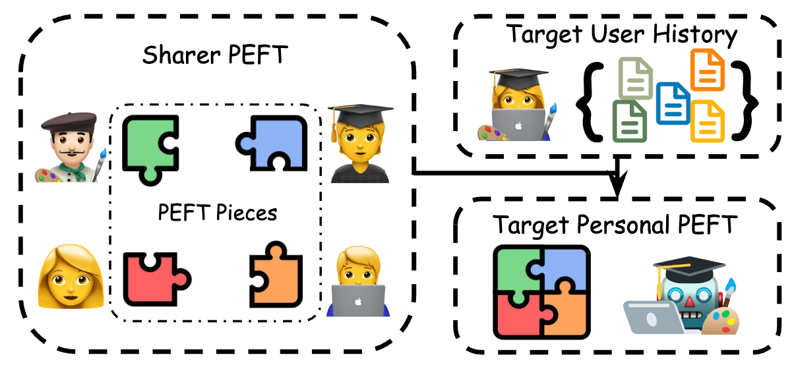
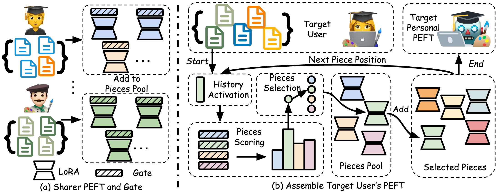

# Personalized Pieces🧩: Efficient Personalized Large Language Models through Collaborative Efforts


This is source code of our EMNLP 2024 paper

[**Personalized Pieces: Efficient Personalized Large Language Models through Collaborative Efforts**](https://arxiv.org/abs/2406.10471).

by
[Zhaoxuan Tan](https://zhaoxuan.info/), 
[Zheyuan Liu](https://franciscoliu.github.io/), 
[Meng Jiang](http://www.meng-jiang.com/).


## Overview ##


Personalized large language models (LLMs) aim to tailor interactions, content, and recommendations to individual user preferences. While parameter-efficient fine-tuning (PEFT) methods excel in performance and generalization, the ["One PEFT Per User"](https://arxiv.org/abs/2402.04401) paradigm is costly and limit communal benefits when used individually.

<div  align="center">    

</div>

To this end, we introduce Personalized Pieces (Per-Pcs), a framework that allows users to safely share and assemble personalized PEFT efficiently with collaborative efforts. Per-Pcs involves selecting sharers, breaking their PEFT into pieces, and training gates for each piece. These pieces are added to a pool, from which target users can select and assemble personalized PEFT using their history data. This approach preserves privacy and enables fine-grained user modeling without excessive storage and computation demands. Experimental results show Per-Pcs outperforms non-personalized and PEFT retrieval baselines, offering performance comparable to OPPU with significantly lower resource use across six tasks. Further analysis highlights Per-Pcs's robustness concerning sharer count and selection strategy, pieces sharing ratio, and scalability in computation time and storage space. Per-Pcs's modularity promotes safe sharing, making LLM personalization more efficient, effective, and widely accessible through collaborative efforts.


<div  align="center">    

</div>

## Environment Setup ##
Please install the dependencies in ```requirements.txt```, using the following command:
```bash
pip install -r requirements.txt
```

## Llama Weight Download ##
We use Llama-2-7b base model in our experiment. To reproduce the result, you will need to first download the Llama-2-7b weights on this [website](https://www.llama.com/llama-downloads/) and place the downloaded files in the ```./llama_download``` folder.


## Dataset ##

We use public available data from the [LaMP](https://arxiv.org/abs/2304.11406) benchmark. You can download the our processed data [here](https://drive.google.com/file/d/1KyiQGWGxNVcqoRXqgMqaq11xEiVJ2Axn/view?usp=sharing), unzip it, and place it under the ```./data``` folder


## Experiment ##
```task_name``` can be selected from ```[citation, movie_tagging, news_headline, product_rating, scholarly_title, tweet_paraphrase]```. Here, we take ```movie_tagging``` as an example.


### 1. Base LLM Task Adaption

```bash
CUDA_VISIBLE_DEVICES=0 python task_LoRA.py \
--task_name movie_tagging \
--llama_model_path ./llama_download/Llama-2-7b \
--tokenizer_path ./llama_download/Llama-2-7b
```

### 2. Anchor Selection

```bash
cd anchor_selection
CUDA_VISIBLE_DEVICES=0 python history_anchor.py --candidate_path ../data/movie_tagging/user_anchor_candidate.json --task_name movie_tagging
cd ..
```

### 3. Train Sharer User PEFT
```bash
CUDA_VISIBLE_DEVICES=0 python train_anchor_PEFT.py \
--task_name movie_tagging \
--llama_model_path ./llama_download/Llama-2-7b \
--tokenizer_path ./llama_download/Llama-2-7b \
--lora_ckpt ./output/movie_tagging/task-base_LLM/lora_ckpt.pt \
--output_dir ./output/movie_tagging/Anchor_PEFT/LoRA 
```

### 4. Train Sharer User Gate
```bash
CUDA_VISIBLE_DEVICES=0 python train_anchor_gate.py \
--task_name movie_tagging \
--llama_model_path ./llama_download/Llama-2-7b \
--tokenizer_path ./llama_download/Llama-2-7b \
--lora_ckpt ./output/movie_tagging/task-base_LLM/lora_ckpt.pt \
--anchor_path ./output/movie_tagging/Anchor_PEFT \
--anchor_idx_path ./anchor_selection/most_active/anchor_user_idx.pt \
--output_dir ./output/movie_tagging/Anchor_PEFT/gate
```

### 5. Assemble Target User PEFT
```bash
CUDA_VISIBLE_DEVICES=0 python lora_composition.py \
--task_name movie_tagging \
--llama_model_path ./llama_download/Llama-2-7b \
--tokenizer_path ./llama_download/Llama-2-7b \
--output_dir ./output/movie_tagging/LoRA-Composition \
--lora_ckpt ./output/movie_tagging/task-base_LLM/lora_ckpt.pt \
--gate_dir ./output/movie_tagging/Anchor_PEFT/gate \
--anchor_dir ./output/movie_tagging/Anchor_PEFT/LoRA \
--topk 3 \
--recent_k 2000 \
--share_ratio 1 \
--agg_temperature 1
```


## Evaluation ##
```TASK_ID``` is the corresponding ID selected from ```["LaMP_1", "LaMP_2N", "LaMP_2M", "LaMP_3", "LaMP_4", "LaMP_5", "LaMP_7"]```

```bash
python ./eval/eval_task.py \
    --golds_json {PATH_TO_LABEL_JSON_FILE} \
    --preds_json {PATH_TO_PREDICTION_JSON_FILE} \
    --task_name {TASK_ID} \
    --output_file {RESULT_JSON_PATH}
```

## Citation ##
If you find this paper or codebase useful in your research, please kindly cite the following papers:

```bibtex
@article{tan2024personalized,
  title={Personalized Pieces: Efficient Personalized Large Language Models through Collaborative Efforts},
  author={Tan, Zhaoxuan and Liu, Zheyuan and Jiang, Meng},
  journal={arXiv preprint arXiv:2406.10471},
  year={2024}
}
```

```bibtex
@article{tan2024democratizing,
  title={Democratizing Large Language Models via Personalized Parameter-Efficient Fine-tuning},
  author={Tan, Zhaoxuan and Zeng, Qingkai and Tian, Yijun and Liu, Zheyuan and Yin, Bing and Jiang, Meng},
  journal={arXiv preprint arXiv:2402.04401},
  year={2024}
}
```